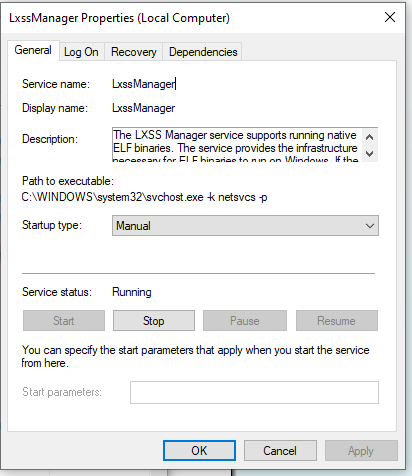
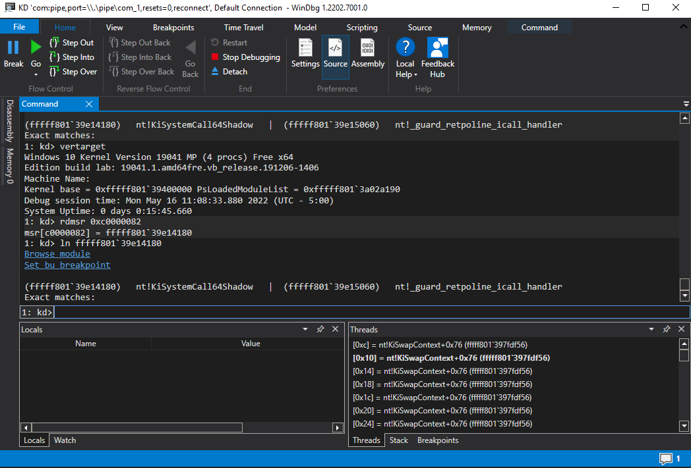

# WSL Version 1

The WSL system is implemented in three major components:

- LxssManager service
- lxss.sys driver
- lxcore.sys driver



The drivers are termed 'pico provider' drivers, and processes invoked using WSL are 'pico' processes

## Pico Processes

The Windows Pico Process concept is explained [here](https://docs.microsoft.com/en-us/archive/blogs/wsl/pico-process-overview). The gist is that Windows Pico processes are distinct from regular processes. They are either supported by provider drivers rather than the Windows kernel, or just empty processes. This leaves many of the implementation details of the process management (such as virtual memory) up to the provider driver.

Minimal process - empty user mode process. Like [memfuck](https://winternl.com/memfuck/) without having to unload everything and no management.

Pico process - Process managed by provider driver for management rather than directly by Windows Kernel.

### System Calls from Pico Processes

Pico processes with provider drivers are unique in that system calls are dispatched to the driver rather than making it to regular system call handlers. It doesn't seem to be well known what drivers are protected by Kernel Patch Protection (KPP), but its possible that WSL provider drivers `lxss.sys` and `lxcore.sys` are not protected.

This leads me to several questions, with my attempts at answering them below:

- what is the provider driver responsible for? e.g. a system call with valid parameters for an ordinary native API is issued. What happens?
- are Pico Provider drivers `syscall tables` protected by patchguard?
- how does the registration process work?
- at what stage of the System Call dispatching process does the check occur?
- what facilities exist for third party drivers (i.e. not ntoskrnl related and not lxss/lxcore) to register callbacks for handlers registed by Pico Providers?


### Pico Process System Calls - What Must the Provider Implement?

As stated in the WSL blog on an [Overview Pico Processes](https://docs.microsoft.com/en-us/archive/blogs/wsl/pico-process-overview), the provider is responsible for all Pico process interfaces with the kernel. It seems that anything needed from the kernel must be explicitly provided by the provider.

### Pico Process System Calls - Protected by Patch Guard?

[According to Alex Ionescu](https://raw.githubusercontent.com/ionescu007/lxss/6a3040fadff5ce43d7bfd638a4e5d7dfe8780143/WSL-BlueHat-Final.pdf), yes, Pico Providers register their handlers with PatchGuard.


### Pico Provider Registration - Registration Process

Pico Provider regisration is very locked down. In addition to only supporting one Pico Provider at a time, Windows requires Pico Providers to be loaded before any other third-party drivers. As "core" drivers, they must be signed by a Microsoft Signer Certificate and Windows Componenet EKU. 

It does not seem that Microsoft provides any documentation for writing other Pico Providers. In addition, there seems to be only one notable (to my knowledge) example of a custom Pico Provider driver.

### Pico Process System Calls - Dispatching to Pico Providers

Answering the question of where pico process system call is dispatched to its provider driver in the dispatching lifecycle involves delving into the Windows kernel. Upon syscall, the instruction pointer is set to an existing value in the LSTAR MSR, which itself is set upon boot. This is the address of the function `nt!KiSystemCallShadow`(`nt!KisystemCall` on spectre-unmitigated versions). 



Next in the workflow is `nt!KiSystemServiceUser`.  Here, `nt!_KPCR` (`gs:00h`), `nt!_KPCRB` (`gs:180h`), and `nt!_KTHREAD` (`gs:188h`) are leveraged to determine the correct course of action. Early in the flow of `nt!KiSystemServiceUser`, a byte comparison against `nt!_KTHREAD+0x03` (technically `nt!_DISPATCHER_HEADER+0x03`) is performed. The first field in `nt!_KTHREAD` is `nt!_DISPATCHER_HEADER`, a data structure with a plethora of uses and versions in use across the Windows kernel. In the context of a thread object, the byte at offset `nt!_DISPATCHER_HEADER+0x03` is read interpreted as a bit field with the name `DebugActive` which has flags to distinguish the current thread context as a minimal process or a pico process. 

During `nt!KiSystemServiceUser`, if `KTHREAD.Header.DebugActive.Minimal` or `KTHREAD.Header.DebugActive.AltSyscall` are set, `PSAltSystemCallDispatch` will be called, which itself will call either `PsAltSystemCallHandlers` or `PsRegisterAltSystemCallHandler`, depending on whether the `Minimal` or `AltSyscall` are set, respectively.

```
typedef struct _DEBUG_FIELDS {
    BOOLEAN ActiveDR7 : 1;
    BOOLEAN Instrumented : 1;
    BOOLEAN Minimal : 1;
    BOOLEAN Reserved4 : 2;
    BOOLEAN AltSyscall : 1;
    BOOLEAN UmsScheduled : 1;
    BOOLEAN UmsPrimary : 1;
} DEBUG_FIELDS;

KiSystemServiceUser(...)
{
    KTHREAD CurrentThread = KeGetCurrentThread();
    ...
    if (CurrentThread.DebugActive)
    {
        if (CurrentThread.DebugActive.ActiveDR7 || CurrentThread.DebugActive.Instrumented)
        {
            KiSaveDebugRegisterState(...);
        }

        if (CurrentThread.DebugActive.Minimal && CurrentThread.AltSyscall)
        {
            if (PsAltSystemCallDispatch(...) == TRUE)
            {
                ...
            }
        }
    }
    ...
}

PUNK PsAltSystemCallDyspatch(...)
{
    FARPROC _PsAltSystemCallRoutine;
    KTHREAD CurrentThread = KeGetCurrentThread();

    if (CurrentThread->Header.DebugActive.Minimal)
    {
        _PsAltSystemCallRoutine = PsAltSystemCallHandlers;
    } else if (CurrentThread->Header.DebugActive.AltSyscall)
    {
        _PsAltSystemCallRoutine = PsRegisterAltSystemCallHandler;
    } else {
        KeBugCheckEx(...);
    }

    return _PsALtSystemCallRoutine(...);
}
```

The function pointed to by the pointer stored in the global variable `PsAltSystemCallHandlers` is a wrapper around `PsPicoSystemCallDispatch`:

```
PUNK PsAltSystemCallHandlers(...)
{
    PsPicoSystemCallDispatch(...);
    return 0;
}

```

From there, the gobal `PspPicoProviderRoutines` array transfers control to the provider, which is just `lxcore` as only one Pico Provider can be registered at a time.

### Hooking / Monitoring Pico Provider Dispatch Tables

It appears that despite devoting good effort to ensuring KPP protection of Pico Providers, facilities for monitoring events and instrumentinng providers with callbacks are absent.

## LxssManager

`LxssManager` is the external interface through which interactions with `lxcore` occur. The `LxssManager` process is a PPL process.

## WSL Version 2 and Virtual Machine Platform

It seems to be common knowledge among WSL users that WSL2 offers a full Linux kernel. Keen users may also have noticed that it is implemented using true virtualization. Interestingly, virtualization was not preferred for the original implementation due to overhead, but it seems by now that Microsoft has come up with a workable solution for this, enabling WSL2 to run as fast or faster as its predecessor.

The Linux Kernel leveraged by WSL2 is open-source. Yet the details behind the virtualization technology it uses are sparse. Microsoft appears to have been quietly making updates to its virtualization technology in for use in coming releases of Windows, with the most noteable use case being a subsystem for Android.

This indicates that the limitation of one subsystem in the Pico Provider model has been surmounted using Microsoft virtualization technology. It will be interesting to see if Pico Processes and Pico Providers are leveraged for other uses in the future, or if they will become vestigial organs of the Operating Systems only supported for the sake of WSL1? It appears to be the latter, for now.

### Hyper-V Architecture

Hyper-V organizes VMs as 'partitions'. Each partition can interact with either a `VMBus` or the hypervisor through the `hypercall` API. Hypercalls seem to be similar to `vm_enter` and `vm_exit` in Intel VT/AMD-V.

## Areas to Explore in the Future

Fuzzing (Microsoft appears to be doing this already):
- WSL1 system call fuzzing 
- WSL1 ELF parser fuzzing


## Other References

- [A syscall journey in the Windows kernel](https://alice.climent-pommeret.red/posts/a-syscall-journey-in-the-windows-kernel/)
- [DISPATCHER_HEADER - Geoff Chappell, Software Analyst](https://www.geoffchappell.com/studies/windows/km/ntoskrnl/inc/ntos/ntosdef_x/dispatcher_header/index.htm)
- [WinAltSyscallHandler](https://github.com/0xcpu/WinAltSyscallHandler/blob/master/README.md)
- [DebugActive - Geoff Chappell, Software Analyst](https://www.geoffchappell.com/studies/windows/km/ntoskrnl/inc/ntos/ntosdef_x/dispatcher_header/debugactive.htm)
- [Gaining visibility into Linux binaries on Windows: Defend and Understand WSL](https://raw.githubusercontent.com/ionescu007/lxss/6a3040fadff5ce43d7bfd638a4e5d7dfe8780143/WSL-BlueHat-Final.pdf)
- [Pico toolbox](https://github.com/thinkcz/pico-toolbox)
- [WSL2-Linux-Kernel](https://github.com/microsoft/WSL2-Linux-Kernel)
- [Hyper-V arhchiecture](https://docs.microsoft.com/en-us/virtualization/hyper-v-on-windows/reference/hyper-v-architecture)
- [https://lkml.iu.edu/hypermail/linux/kernel/2102.2/00124.html]
- [Developing WSL distributions in Visual Studio](https://devblogs.microsoft.com/commandline/build-and-debug-c-with-wsl-2-distributions-and-visual-studio-2022/)